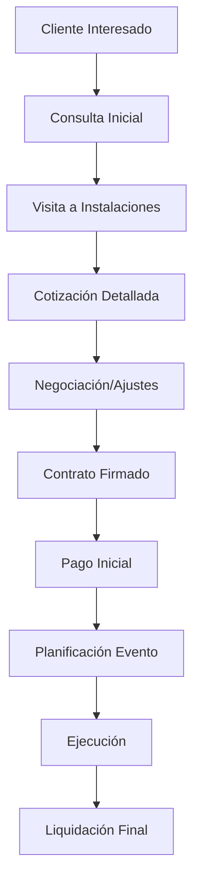

# 🏢 ANÁLISIS CRM CASONA - PLAN DE IMPLEMENTACIÓN

**Proyecto:** Migración/Integración CRM Casona → Gestión de Eventos V3  
**Fecha:** 16 de octubre de 2025  
**Objetivo:** Analizar y documentar el proceso de implementación

---

## 🎯 SITUACIÓN ACTUAL

### **¿Qué tenemos?**
✅ **Gestión de Eventos V3 (Base Moderna)**
- Next.js 14 + TypeScript + PostgreSQL 16
- Arquitectura DRY implementada
- Agente AI conversacional completo
- Sistema de autenticación NextAuth.js v5
- API REST con middleware avanzado
- Búsqueda semántica con pgvector
- Docker Compose para desarrollo

### **¿Qué necesitamos?**
🎯 **CRM Casona (Funcionalidades del Negocio)**
- Datos reales de clientes, eventos y venues
- Procesos de negocio específicos de Casona
- Integraciones existentes (contabilidad, proveedores)
- Configuraciones personalizadas
- Histórico de transacciones

---

## 🔍 ANÁLISIS REQUERIDO DEL CRM CASONA

### **1. Análisis de Datos y Estructura**

#### **Base de Datos Actual**
```sql
-- NECESITAMOS MAPEAR:
📊 Tablas principales:
  - Clientes (estructura, campos personalizados)
  - Eventos (tipos, estados específicos)
  - Venues/Espacios (características de Casona)
  - Cotizaciones (formato, aprobaciones)
  - Proveedores (catálogos, precios)
  - Facturas (sistema contable)

📈 Volumen de datos:
  - Número de clientes activos
  - Eventos por año/mes
  - Cotizaciones históricas
  - Transacciones financieras
```

#### **Campos Personalizados de Casona**
```typescript
// EJEMPLO - NECESITA VALIDACIÓN:
interface CasonaEvent {
  // Campos estándar
  id: string;
  title: string;
  clientId: string;
  
  // Campos específicos de Casona (POR CONFIRMAR)
  eventCategory?: 'boda' | 'corporativo' | 'social' | 'quinceañera';
  musicPreference?: string;
  cateringStyle?: 'buffet' | 'plated' | 'cocktail';
  decorationTheme?: string;
  specialRequests?: string[];
  
  // Campos financieros
  advancePayment?: number;
  finalBalance?: number;
  paymentStatus?: 'pending' | 'partial' | 'complete';
}
```

### **2. Análisis de Procesos de Negocio**

#### **Flujo de Trabajo Actual de Casona**


#### **Integaciones Actuales (POR CONFIRMAR)**
- **Sistema Contable**: ¿SAP? ¿QuickBooks? ¿Sistema propio?
- **Proveedores**: ¿API de catálogos? ¿Sistema manual?
- **Pagos**: ¿Procesador de pagos integrado?
- **Comunicación**: ¿Email automatizado? ¿WhatsApp Business?

### **3. Análisis de Usuarios y Roles**

#### **Roles Específicos de Casona**
```typescript
// ROLES A CONFIRMAR:
type CasonaUserRole = 
  | 'admin'           // Administrador general
  | 'manager'         // Gerente de operaciones
  | 'sales'           // Ejecutivo de ventas
  | 'coordinator'     // Coordinador de eventos
  | 'finance'         // Contabilidad/finanzas
  | 'venue_manager'   // Encargado de instalaciones
  | 'catering'        // Coordinador de catering
  | 'technical'       // Técnico de sonido/iluminación
```

---

## 📋 PLAN DE LEVANTAMIENTO DE INFORMACIÓN

### **Fase 1: Reunión de Análisis con Casona (1-2 días)**

#### **Sesión 1: Análisis de Datos**
⏰ **Duración**: 3-4 horas  
👥 **Participantes**: Gerente General, IT/Sistemas, Contabilidad

**Agenda:**
1. **Tour del Sistema Actual** (30 min)
   - Demostración del CRM actual
   - Navegación por módulos principales
   - Identificación de funcionalidades críticas

2. **Análisis de Base de Datos** (90 min)
   - Estructura de tablas principales
   - Campos personalizados y sus usos
   - Relaciones entre entidades
   - Volumen de datos históricos

3. **Exportación de Datos de Muestra** (60 min)
   - Exportar esquema de base de datos
   - Generar datos de prueba anonimizados
   - Identificar formatos de importación

#### **Sesión 2: Procesos de Negocio**
⏰ **Duración**: 3-4 horas  
👥 **Participantes**: Gerente Operaciones, Ventas, Coordinadores

**Agenda:**
1. **Mapeo de Procesos** (90 min)
   - Flujo desde contacto inicial hasta evento finalizado
   - Puntos de decisión y aprobaciones
   - Documentos generados en cada etapa

2. **Análisis de Integraciones** (60 min)
   - Sistemas externos conectados
   - APIs utilizadas
   - Procesos automatizados vs manuales

3. **Identificación de Pain Points** (60 min)
   - Problemas del sistema actual
   - Procesos que consumen más tiempo
   - Funcionalidades deseadas

### **Fase 2: Análisis Técnico (1 día)**

#### **Sesión 3: Revisión Técnica**
⏰ **Duración**: 4-6 horas  
👥 **Participantes**: Equipo técnico, Administrador de sistemas

**Checklist Técnico:**
- [ ] Tecnología del CRM actual
- [ ] Versión de base de datos
- [ ] Métodos de backup/exportación
- [ ] Documentación técnica disponible
- [ ] Credenciales de acceso para migración
- [ ] Servidores y infraestructura actual

---

## 🔄 ESTRATEGIAS DE MIGRACIÓN

### **Opción A: Migración Completa**
**Pros:**
- Sistema completamente nuevo y moderno
- Aprovecha todas las mejoras de V3
- Agente AI desde el día 1

**Contras:**
- Mayor tiempo de implementación
- Requiere migración completa de datos
- Curva de aprendizaje para usuarios

**Tiempo Estimado:** 4-6 semanas

### **Opción B: Integración Híbrida**
**Pros:**
- Mantiene sistema actual funcionando
- Implementación gradual
- Menor riesgo operacional

**Contras:**
- Complejidad de mantener dos sistemas
- Sincronización de datos
- Costos duplicados temporalmente

**Tiempo Estimado:** 6-8 semanas

### **Opción C: Mejora Incremental**
**Pros:**
- Menor interrupción operacional
- Implementación por módulos
- ROI más temprano

**Contras:**
- No aprovecha toda la modernización
- Posibles inconsistencias
- Migración más larga

**Tiempo Estimado:** 8-12 semanas

---

## 🗂️ DOCUMENTOS A GENERAR

### **1. Documento de Análisis de Requerimientos**
```
📄 CRM_CASONA_REQUIREMENTS_ANALYSIS.md
├── Funcionalidades actuales
├── Campos personalizados identificados
├── Procesos de negocio mapeados
├── Integraciones existentes
└── Usuarios y permisos
```

### **2. Plan de Migración de Datos**
```
📄 DATA_MIGRATION_PLAN.md
├── Mapeo de esquemas (Casona → V3)
├── Scripts de transformación
├── Estrategia de migración
├── Plan de validación
└── Rollback procedures
```

### **3. Cronograma de Implementación**
```
📄 IMPLEMENTATION_TIMELINE.md
├── Fases de implementación
├── Hitos y entregables
├── Recursos necesarios
├── Riesgos identificados
└── Plan de contingencia
```

### **4. Plan de Capacitación**
```
📄 TRAINING_PLAN.md
├── Usuarios objetivo por rol
├── Sesiones de capacitación
├── Materiales de entrenamiento
├── Proceso de adopción
└── Soporte post-implementación
```

---

## 📊 ESTIMACIÓN PRELIMINAR

### **Recursos Necesarios**
```
👨‍💻 Desarrollo:
- 1 Senior Developer: 4-6 semanas
- 1 Frontend Developer: 2-3 semanas  
- 1 Database Expert: 1-2 semanas

🏢 Casona:
- 1 Project Manager: 6-8 semanas (part-time)
- Key Users: 1-2 semanas para training
- IT Support: 1 semana para migración

💰 Costos Estimados:
- Desarrollo: $15,000 - $25,000
- Migración datos: $3,000 - $5,000
- Capacitación: $2,000 - $3,000
- Contingencia (20%): $4,000 - $6,600
Total: $24,000 - $39,600
```

### **Timeline Sugerido**
```
Semana 1-2: Análisis y levantamiento
Semana 3-4: Diseño y arquitectura
Semana 5-8: Desarrollo de customizaciones
Semana 9-10: Migración de datos
Semana 11-12: Testing y capacitación
Semana 13: Go-live y soporte
```

---

## ✅ PRÓXIMOS PASOS RECOMENDADOS

### **Inmediatos (Esta semana)**
1. **Agendar reunión inicial con Casona**
   - Presentar Gestión de Eventos V3
   - Explicar beneficios del agente AI
   - Acordar sesiones de análisis

2. **Preparar demo personalizado**
   - Configurar con datos similares a Casona
   - Demostrar agente AI con casos de uso reales
   - Mostrar capacidades de búsqueda semántica

### **Corto plazo (Próximas 2 semanas)**
1. **Ejecutar Plan de Levantamiento**
   - Sesiones de análisis programadas
   - Documentar findings
   - Generar matriz de requerimientos

2. **Crear plan detallado de implementación**
   - Seleccionar estrategia de migración
   - Definir cronograma específico
   - Asignar recursos y responsabilidades

### **Mediano plazo (Próximo mes)**
1. **Iniciar desarrollo customizado**
   - Adaptaciones específicas para Casona
   - Migración de datos piloto
   - Testing con usuarios clave

---

## 🎯 CRITERIOS DE ÉXITO

### **Técnicos**
- ✅ Migración 100% de datos críticos
- ✅ Sistema funcionando sin interrupciones
- ✅ Agente AI respondiendo consultas reales
- ✅ Integraciónes externas funcionando

### **Negocio**
- ✅ Usuarios adoptando el nuevo sistema
- ✅ Reducción de tiempo en tareas rutinarias  
- ✅ Mejora en experiencia del cliente
- ✅ ROI positivo en 6 meses

### **Operacionales**
- ✅ Capacitación completada al 100%
- ✅ Procesos documentados y optimizados
- ✅ Plan de soporte post-implementación
- ✅ Métricas de uso y satisfacción

---

## 📞 CONTACTO PARA COORDINACIÓN

**Equipo Técnico:**
- Desarrollo: desarrollo@gestioneventos.com
- Project Manager: pm@gestioneventos.com  
- Soporte: soporte@gestioneventos.com

**Próxima Acción:**
🎯 **Agendar reunión inicial con Casona para presentar V3 y acordar plan de análisis**

---

📋 **Documento preparado para iniciar análisis del CRM Casona**  
🎯 **Objetivo:** Implementación exitosa de Gestión de Eventos V3 con Agente AI  
📅 **Fecha límite sugerida:** Finalizar análisis en 2 semanas