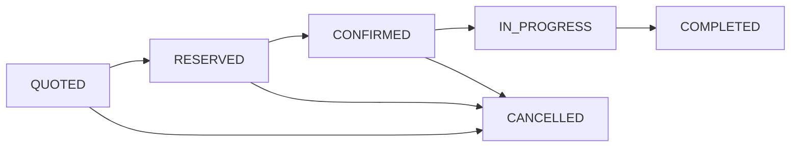

# 📋 PLAN DETALLADO FASE 2 - GESTIÓN DE EVENTOS V3

**Basado en:** Experiencia y lecciones aprendidas del CRM Casona María V2.0  
**Objetivo:** Sistema comercial profesional de gestión de eventos  
**Duración estimada:** 4-6 iteraciones de desarrollo

## 🎯 ARQUITECTURA MEJORADA

### Mejoras vs CRM Casona María
1. **Esquema de BD simplificado** - Eliminar complejidad innecesaria
2. **Autenticación moderna** - NextAuth.js v5 vs v4
3. **UI más consistente** - Un solo sistema de diseño (Shadcn/ui)
4. **Performance optimizada** - Next.js 14 con Turbopack
5. **Mejor UX** - Interfaces más intuitivas basadas en feedback

## 📊 ITERACIÓN 1: DASHBOARD AVANZADO (v0.2.0)

### 🎪 Componentes Principales

#### 1. Dashboard Principal
```typescript
// Métricas en tiempo real
- Total de eventos (filtrable por período)
- Revenue generado y proyectado
- Clientes activos vs nuevos
- Ocupación de venues por período
- Cotizaciones pendientes de aprobación
```

#### 2. Widgets Interactivos
```typescript
// Gráficos y visualizaciones
- Calendario de eventos (vista mensual)
- Gráfico de revenue por mes/trimestre
- Top 5 clientes por facturación
- Venues más solicitados
- Productos/servicios más vendidos
```

#### 3. Acciones Rápidas
```typescript
// Shortcuts para operaciones comunes
- Crear evento rápido
- Nueva cotización
- Registrar cliente
- Ver eventos de hoy
- Cotizaciones por vencer
```

### 🔧 Implementación Técnica

#### Archivos a crear:
```
src/app/dashboard/
├── page.tsx                 # Dashboard principal
├── components/
│   ├── StatsCards.tsx       # Tarjetas de métricas
│   ├── RevenueChart.tsx     # Gráfico de ingresos
│   ├── EventsCalendar.tsx   # Vista de calendario
│   ├── QuickActions.tsx     # Acciones rápidas
│   └── RecentActivity.tsx   # Actividad reciente

src/lib/
├── dashboard-stats.ts       # Lógica de métricas
└── chart-utils.ts          # Utilidades para gráficos

src/components/
├── layout/
│   ├── Sidebar.tsx         # Navegación lateral
│   ├── Header.tsx          # Header principal
│   └── MainLayout.tsx      # Layout wrapper
```

#### APIs necesarias:
```
src/app/api/
├── dashboard/
│   ├── stats/route.ts      # Métricas generales
│   ├── revenue/route.ts    # Datos de revenue
│   └── activity/route.ts   # Actividad reciente
```

## 📋 ITERACIÓN 2: GESTIÓN DE CLIENTES (v0.3.0)

### 🎪 Funcionalidades

#### 1. CRUD Completo
- [x] Schema ya definido en Prisma
- [ ] Formularios de creación/edición
- [ ] Validación con Zod schemas
- [ ] Soft delete vs hard delete

#### 2. Funciones Avanzadas
```typescript
// Basado en CRM Casona María
- Búsqueda global por nombre/email/teléfono
- Filtros: tipo de cliente, fecha registro, estado
- Historial completo de eventos
- Notas y comentarios
- Documentos adjuntos
- Integración con WhatsApp (futuro)
```

#### 3. Tipos de Cliente
```typescript
enum ClientType {
  INDIVIDUAL = "Persona natural"
  CORPORATE = "Empresa/Corporativo"  
  GOVERNMENT = "Gobierno/Institución"
  NONPROFIT = "ONG/Sin fines de lucro"
}
```

### 🔧 Mejoras vs Casona María

#### Problemas identificados en Casona María:
1. **Filtros lentos** → Implementar paginación server-side
2. **UI inconsistente** → Usar Shadcn/ui exclusivamente  
3. **Búsqueda básica** → Full-text search con PostgreSQL
4. **No responsive** → Mobile-first design

#### Soluciones implementadas:
```typescript
// Búsqueda optimizada
const searchClients = async (query: string, filters: ClientFilters) => {
  return await prisma.client.findMany({
    where: {
      OR: [
        { name: { contains: query, mode: 'insensitive' } },
        { email: { contains: query, mode: 'insensitive' } },
        { phone: { contains: query, mode: 'insensitive' } },
      ],
      clientType: filters.type,
      createdAt: {
        gte: filters.dateFrom,
        lte: filters.dateTo,
      },
    },
    include: {
      events: { orderBy: { createdAt: 'desc' }, take: 5 },
      quotes: { orderBy: { createdAt: 'desc' }, take: 5 },
    },
    orderBy: { createdAt: 'desc' },
    skip: (filters.page - 1) * filters.limit,
    take: filters.limit,
  })
}
```

## 🎪 ITERACIÓN 3: SISTEMA DE EVENTOS (v0.4.0)

### 🗓️ Calendario Interactivo

#### FullCalendar v6 Integration
```typescript
// Configuración optimizada basada en Casona María
const calendarConfig = {
  initialView: 'dayGridMonth',
  headerToolbar: {
    left: 'prev,next today',
    center: 'title',
    right: 'dayGridMonth,timeGridWeek,timeGridDay'
  },
  events: '/api/calendar/events',
  eventClick: handleEventClick,
  dateClick: handleDateClick,
  eventDrop: handleEventDrop, // Drag & drop
  eventResize: handleEventResize,
  businessHours: {
    daysOfWeek: [1, 2, 3, 4, 5, 6], // Lun-Sab
    startTime: '08:00',
    endTime: '22:00',
  },
}
```

#### Funcionalidades del Calendario
- [x] Vista mensual/semanal/diaria
- [ ] Drag & drop para reagendar
- [ ] Conflictos de horarios automáticos
- [ ] Colores por tipo de evento
- [ ] Filtros por venue, cliente, estado
- [ ] Exportar a Google Calendar/Outlook

### 🎭 Gestión de Eventos

#### Estados de Eventos (Mejorados)
```typescript
enum EventStatus {
  QUOTED = "Cotizado"           // Solo cotización generada
  RESERVED = "Reservado"        // 50% de anticipo
  CONFIRMED = "Confirmado"      // 100% pagado
  IN_PROGRESS = "En Progreso"   // Evento ejecutándose
  COMPLETED = "Completado"      // Evento finalizado
  CANCELLED = "Cancelado"       // Cancelado por cliente/empresa
}
```

#### Workflow de Eventos


## 💰 ITERACIÓN 4: SISTEMA DE COTIZACIONES (v0.5.0)

### 📄 Generación de Cotizaciones

#### Workflow Mejorado
```typescript
enum QuoteStatus {
  DRAFT = "Borrador"              // En construcción
  PENDING_APPROVAL = "Pendiente"  // Para aprobación manager
  APPROVED = "Aprobado"           // Listo para enviar
  SENT_TO_CLIENT = "Enviado"      // Enviado al cliente
  ACCEPTED = "Aceptado"           // Cliente acepta
  REJECTED = "Rechazado"          // Cliente rechaza
  EXPIRED = "Expirado"            // Pasó fecha límite
}
```

#### Características de Cotizaciones
- [ ] Templates personalizables
- [ ] Cálculo automático de impuestos
- [ ] Descuentos por volumen/tipo cliente
- [ ] Términos y condiciones dinámicos
- [ ] Firma digital
- [ ] Generación de contratos automática

### 🎨 Generación de PDFs

#### Tecnología: `@react-pdf/renderer`
```typescript
// Estructura del PDF
const QuotePDF = ({ quote }: { quote: QuoteWithDetails }) => (
  <Document>
    <Page size="A4" style={styles.page}>
      <View style={styles.header}>
        {/* Logo y datos empresa */}
      </View>
      <View style={styles.client}>
        {/* Datos del cliente */}
      </View>
      <View style={styles.items}>
        {/* Desglose de items */}
      </View>
      <View style={styles.totals}>
        {/* Subtotal, impuestos, total */}
      </View>
      <View style={styles.terms}>
        {/* Términos y condiciones */}
      </View>
    </Page>
  </Document>
)
```

## 🏗️ ARQUITECTURA TÉCNICA

### Stack Actualizado
```typescript
// Frontend
- Next.js 14.2.0 (App Router)
- TypeScript 5.3.0 (strict mode)
- Tailwind CSS 3.4.0
- Shadcn/ui (New York style)
- Radix UI primitives
- Lucide React icons

// Backend  
- Next.js API Routes
- Prisma ORM 5.22.0
- PostgreSQL 15
- NextAuth.js v5 beta

// DevOps
- Docker Compose
- Turbopack (development)
- ESLint + Prettier
- Husky git hooks

// Nuevas librerías
- @react-pdf/renderer (PDFs)
- recharts (gráficos)
- @tanstack/react-table (tablas)
- react-hook-form + zod (formularios)
- date-fns (fechas)
- @fullcalendar/react (calendario)
```

### Patrón de Organización
```
src/
├── app/                    # App Router
│   ├── (dashboard)/       # Grupo de rutas dashboard
│   │   ├── clients/       # Gestión clientes
│   │   ├── events/        # Gestión eventos  
│   │   ├── quotes/        # Cotizaciones
│   │   └── calendar/      # Vista calendario
│   ├── api/               # API routes
│   └── auth/              # Autenticación
├── components/            # Componentes reutilizables
│   ├── ui/               # Shadcn/ui components
│   ├── forms/            # Formularios específicos
│   ├── layout/           # Componentes de layout
│   └── charts/           # Gráficos y visualizaciones
├── lib/                  # Utilidades y configuración
├── hooks/                # Custom React hooks
├── types/                # Tipos TypeScript
└── styles/               # Estilos personalizados
```

## 🎯 MÉTRICAS DE ÉXITO

### KPIs Técnicos
- **Performance:** < 2s First Contentful Paint
- **Accessibility:** Score AA WCAG
- **SEO:** > 90 Lighthouse score
- **Bundle size:** < 500KB inicial
- **Test coverage:** > 80%

### KPIs de Negocio
- **User adoption:** Dashboard utilizado diariamente
- **Workflow efficiency:** 50% reducción tiempo cotizaciones
- **Error reduction:** 90% menos errores entrada datos
- **Client satisfaction:** Sistema intuitivo y rápido

## 📅 CRONOGRAMA ESTIMADO

| Iteración | Duración | Funcionalidades | Versión |
|-----------|----------|-----------------|---------|
| 1 | 5-7 días | Dashboard avanzado | v0.2.0 |
| 2 | 7-10 días | CRUD Clientes completo | v0.3.0 |
| 3 | 10-14 días | Sistema eventos + calendario | v0.4.0 |
| 4 | 7-10 días | Cotizaciones + PDFs | v0.5.0 |

**Total estimado:** 4-6 semanas para MVP comercial completo

---

*Plan actualizado basado en experiencia CRM Casona María - Octubre 2025*