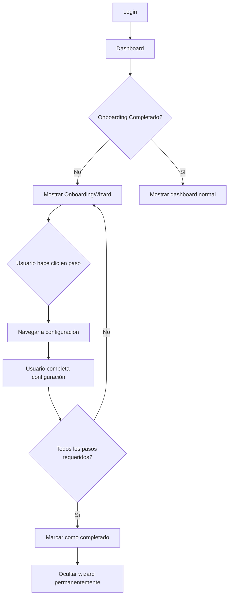

# Sistema de Onboarding para Nuevos Tenants

## 📋 Descripción General

Sistema completo de onboarding que guía a los nuevos tenants a través de la configuración inicial de su cuenta en Plexo.

## 🎯 Objetivos

1. **Guiar** a los nuevos usuarios a través de los pasos esenciales de configuración
2. **Simplificar** el proceso de setup inicial
3. **Aumentar** la tasa de activación de nuevos tenants
4. **Reducir** el tiempo hasta el primer evento creado

## 🏗️ Arquitectura

### Modelo de Datos (Prisma Schema)

```prisma
model Tenant {
  id                  String  @id @default(cuid())
  name                String
  domain              String  @unique
  isActive            Boolean @default(true)
  onboardingCompleted Boolean @default(false)  // ✨ NUEVO
  onboardingStep      Int     @default(0)      // ✨ NUEVO
  createdAt           DateTime @default(now())
  updatedAt           DateTime @updatedAt
  // ... relaciones existentes
}
```

**Nuevos Campos:**
- `onboardingCompleted`: Boolean que indica si el tenant completó el onboarding
- `onboardingStep`: Int que guarda el paso actual (0-5) para reanudar más tarde

### API Endpoints

#### **GET /api/onboarding**
Obtiene el estado del onboarding del tenant actual

**Response:**
```json
{
  "success": true,
  "data": {
    "tenant": {
      "id": "tenant_123",
      "name": "Mi Empresa",
      "onboardingCompleted": false,
      "onboardingStep": 2
    },
    "steps": [
      {
        "id": 1,
        "title": "Configuración de Negocio",
        "description": "Configura el nombre, logo y datos de contacto",
        "completed": true,
        "required": true,
        "href": "/dashboard/settings/branding"
      },
      // ... más pasos
    ],
    "progress": {
      "completed": 2,
      "total": 5,
      "required": 4,
      "requiredCompleted": 2,
      "percentage": 40,
      "isComplete": false
    }
  }
}
```

#### **PUT /api/onboarding**
Actualiza el estado del onboarding

**Request:**
```json
{
  "completed": true,
  "step": 5
}
```

### Pasos del Onboarding

| # | Título | Descripción | Requerido | Ruta |
|---|--------|-------------|-----------|------|
| 1 | Configuración de Negocio | Logo, eslogan, datos de contacto | ✅ Sí | `/dashboard/settings/branding` |
| 2 | Ubicaciones y Salas | Agregar ubicaciones y salas disponibles | ✅ Sí | `/dashboard/settings/locations` |
| 3 | Turnos Laborales | Definir horarios de trabajo | ✅ Sí | `/dashboard/settings/work-shifts` |
| 4 | Listas de Precios | Configurar precios por sala | ✅ Sí | `/dashboard/settings/price-lists` |
| 5 | Integraciones | WhatsApp y MercadoPago | ❌ Opcional | `/dashboard/settings/integrations` |

### Componente UI

**`OnboardingWizard.tsx`** - Modal overlay con:
- ✅ Progress bar visual
- ✅ Lista de pasos con iconos
- ✅ Indicadores de completado (checkmarks verdes)
- ✅ Labels "Requerido" / "Opcional"
- ✅ Navegación directa a cada paso
- ✅ Opción de "Omitir por ahora"
- ✅ Persistencia en localStorage

## 🎨 UI/UX

### Estados Visuales

**Paso Completado:**
```
┌────────────────────────────────────┐
│ [✓] Configuración de Negocio   →  │
│     Logo y datos configurados      │
│     [Requerido]                    │
└────────────────────────────────────┘
```

**Paso Pendiente:**
```
┌────────────────────────────────────┐
│ [📍] Ubicaciones y Salas        →  │
│     Agrega tus ubicaciones         │
│     [Requerido]                    │
└────────────────────────────────────┘
```

**Paso Opcional:**
```
┌────────────────────────────────────┐
│ [⚡] Integraciones               →  │
│     WhatsApp y MercadoPago         │
│     [Opcional]                     │
└────────────────────────────────────┘
```

### Barra de Progreso

```
Progreso General                    2 de 5 completados
[████████░░░░░░░░░░░░] 40%
2 de 4 pasos requeridos completados
```

## 🔒 Seguridad

- Solo **TENANT_ADMIN** puede actualizar el estado del onboarding
- Solo se muestra a tenants con rol `TENANT_ADMIN`
- Cada tenant solo ve su propio progreso (aislamiento por tenantId)

## 💾 Persistencia

1. **Base de Datos**: Estado guardado en `Tenant.onboardingCompleted` y `Tenant.onboardingStep`
2. **localStorage**: Flag `onboarding-dismissed` para no volver a mostrar si el usuario lo omitió

## 🚀 Flujo de Usuario

### Primera Vez (Tenant Nuevo)



### Usuario Omite Onboarding

```mermaid
graph TD
    A[OnboardingWizard visible] --> B{Usuario hace clic "Omitir"}
    B --> C[Guardar en localStorage]
    C --> D[Ocultar wizard]
    D --> E[Usuario puede volver desde settings]
```

## 🧪 Testing

### Test Checklist

- [ ] Nuevo tenant ve el wizard al primer login
- [ ] Progress bar actualiza correctamente
- [ ] Click en paso navega a la ruta correcta
- [ ] Steps se marcan como completados al agregar datos
- [ ] "Omitir" oculta el wizard permanentemente
- [ ] TENANT_ADMIN vs otros roles (solo TENANT_ADMIN ve wizard)
- [ ] Múltiples tenants no ven el progreso de otros
- [ ] Wizard desaparece al completar todos los pasos requeridos

### Casos de Prueba

**1. Tenant Nuevo (sin datos):**
- Todos los pasos en gris
- Progress: 0%
- Botón: "Continuar configuración"

**2. Tenant con algunos pasos completados:**
- Algunos pasos con checkmark verde
- Progress: 40-80%
- Botón: "Continuar configuración"

**3. Tenant con todos los pasos requeridos:**
- 4 pasos con checkmark
- Progress: 80%+
- Wizard se auto-oculta
- Botón: "¡Comenzar! 🚀"

## 📦 Archivos Creados

```
src/
├── app/
│   └── api/
│       └── onboarding/
│           └── route.ts              # GET, PUT endpoints
├── components/
│   ├── onboarding/
│   │   └── OnboardingWizard.tsx      # Modal UI component
│   └── ui/
│       └── progress.tsx              # Progress bar component (Radix UI)
└── prisma/
    └── schema.prisma                 # +2 campos en Tenant
```

## 🔄 Migración Necesaria

```bash
# Después de actualizar schema.prisma
npx prisma migrate dev --name add_onboarding_fields_to_tenant

# Generar cliente de Prisma
npx prisma generate
```

**SQL Migration:**
```sql
ALTER TABLE "tenants" 
ADD COLUMN "onboardingCompleted" BOOLEAN NOT NULL DEFAULT false,
ADD COLUMN "onboardingStep" INTEGER NOT NULL DEFAULT 0;
```

## 🎯 Mejoras Futuras

1. **Analytics**: Trackear tiempo promedio de completado
2. **Emails**: Enviar recordatorios si no completan en X días
3. **Gamificación**: Badges o recompensas por completar
4. **Tour guiado**: Tooltips interactivos en cada paso
5. **Video tutoriales**: Embedded en cada paso
6. **Checklist persistente**: Widget en dashboard incluso después de completar

## 📊 Métricas a Monitorear

- **Tasa de completado**: % de tenants que terminan onboarding
- **Tiempo promedio**: Cuánto tardan en completar
- **Paso con más abandono**: Dónde se quedan atascados
- **Tasa de omisión**: Cuántos hacen "Skip"

## 🌟 Beneficios del Sistema

✅ **Mejor experiencia de usuario**: Guía clara desde el primer día
✅ **Mayor activación**: Tenants configurados correctamente desde el inicio
✅ **Menos soporte**: Usuarios saben qué configurar
✅ **Datos completos**: Asegura que tenants configuren lo esencial
✅ **Flexibilidad**: Usuarios pueden omitir y retomar después

---

**Fecha de Implementación**: 1 de Noviembre de 2025  
**Autor**: AI Assistant  
**Estado**: ✅ Listo para testing (requiere migración de DB)
