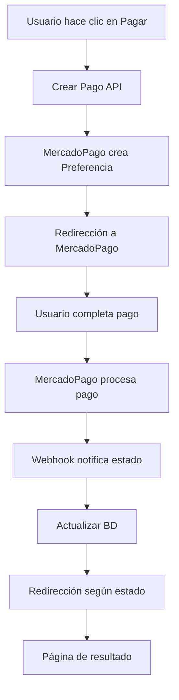

# 💳 Integración MercadoPago - Guía Completa

## 📋 Índice

1. [Configuración Inicial](#configuración-inicial)
2. [Estructura de APIs](#estructura-de-apis)
3. [Componentes React](#componentes-react)
4. [Flujo de Pagos](#flujo-de-pagos)
5. [Webhooks](#webhooks)
6. [Testing](#testing)
7. [Troubleshooting](#troubleshooting)

## 🚀 Configuración Inicial

### Requisitos Previos

1. **Cuenta MercadoPago**: Crear cuenta en [MercadoPago](https://www.mercadopago.com.ar)
2. **Aplicación**: Crear aplicación en [Panel de Desarrolladores](https://www.mercadopago.com.ar/developers/panel)
3. **Credenciales**: Obtener tokens de testing y producción

### Variables de Entorno

```env
# Testing (Sandbox)
MERCADOPAGO_ACCESS_TOKEN="TEST-1234567890-032912-abcdef1234567890abcdef1234567890-123456789"

# Producción
MERCADOPAGO_ACCESS_TOKEN="APP_USR-1234567890-032912-abcdef1234567890abcdef1234567890-123456789"

# URLs base
NEXTAUTH_URL="http://localhost:3200"
```

### Instalación de Dependencias

```bash
npm install mercadopago
npm install @types/mercadopago
```

## 🏗️ Estructura de APIs

### 1. Crear Pago (`/api/payments/create-payment`)

**Funcionalidad**: Crea una preferencia de pago en MercadoPago

```typescript
// POST /api/payments/create-payment
{
  "quoteId": "clm123...",
  "title": "Evento Empresarial - Salón Principal",
  "description": "Alquiler de salón para evento empresarial",
  "amount": 50000,
  "currency": "ARS"
}
```

**Respuesta**:
```typescript
{
  "success": true,
  "payment": {
    "id": "clm456...",
    "mercadopagoId": "1234567890",
    "amount": 50000,
    "status": "pending"
  },
  "preferenceUrl": "https://www.mercadopago.com.ar/checkout/v1/redirect?pref_id=123456789-abc123..."
}
```

### 2. Webhook (`/api/payments/webhook`)

**Funcionalidad**: Recibe notificaciones de MercadoPago sobre cambios de estado

```typescript
// POST /api/payments/webhook
{
  "action": "payment.updated",
  "api_version": "v1",
  "data": {
    "id": "1234567890"
  },
  "date_created": "2024-01-15T10:30:00Z",
  "id": 98765,
  "live_mode": false,
  "type": "payment",
  "user_id": "123456"
}
```

### 3. Estado de Pago (`/api/payments/status/[id]`)

**Funcionalidad**: Consulta el estado actual de un pago

```typescript
// GET /api/payments/status/clm123...
{
  "success": true,
  "payment": {
    "id": "clm123...",
    "mercadopagoId": "1234567890",
    "amount": 50000,
    "status": "approved",
    "statusDetail": "accredited",
    "createdAt": "2024-01-15T10:00:00Z",
    "updatedAt": "2024-01-15T10:30:00Z"
  }
}
```

### 4. Lista de Pagos (`/api/payments`)

**Funcionalidad**: Lista pagos con filtros y paginación

```typescript
// GET /api/payments?status=approved&page=1&limit=10
{
  "success": true,
  "payments": [
    {
      "id": "clm123...",
      "amount": 50000,
      "status": "approved",
      "quote": {
        "id": "clm456...",
        "title": "Evento Empresarial"
      },
      "createdAt": "2024-01-15T10:00:00Z"
    }
  ],
  "pagination": {
    "page": 1,
    "limit": 10,
    "total": 25,
    "pages": 3
  }
}
```

## ⚛️ Componentes React

### 1. MercadoPagoPaymentButton

**Ubicación**: `src/components/payments/MercadoPagoPaymentButton.tsx`

**Uso**:
```tsx
<MercadoPagoPaymentButton
  quoteId="clm123..."
  amount={50000}
  title="Evento Empresarial"
  description="Alquiler de salón principal"
  onSuccess={(payment) => console.log('Pago creado:', payment)}
  onError={(error) => console.error('Error:', error)}
/>
```

**Props**:
- `quoteId`: ID de la cotización
- `amount`: Monto en centavos
- `title`: Título del pago
- `description`: Descripción detallada
- `onSuccess`: Callback cuando se crea el pago
- `onError`: Callback en caso de error

### 2. PaymentStatus

**Ubicación**: `src/components/payments/PaymentStatus.tsx`

**Uso**:
```tsx
<PaymentStatus
  paymentId="clm123..."
  showRefresh={true}
  autoRefresh={30000}
  onStatusChange={(status) => console.log('Nuevo estado:', status)}
/>
```

**Props**:
- `paymentId`: ID del pago a consultar
- `showRefresh`: Mostrar botón de actualizar
- `autoRefresh`: Intervalo de actualización automática (ms)
- `onStatusChange`: Callback cuando cambia el estado

## 🔄 Flujo de Pagos

### Diagrama de Flujo



### Estados de Pago

| Estado MP | Estado Sistema | Descripción |
|-----------|----------------|-------------|
| `pending` | `pending` | Esperando procesamiento |
| `approved` | `approved` | Pago aprobado |
| `authorized` | `authorized` | Autorizado, pendiente captura |
| `in_process` | `in_process` | En proceso de verificación |
| `in_mediation` | `in_mediation` | En mediación |
| `rejected` | `rejected` | Pago rechazado |
| `cancelled` | `cancelled` | Pago cancelado |
| `refunded` | `refunded` | Reembolsado |
| `charged_back` | `charged_back` | Contracargo |

### Actualizaciones Automáticas

Cuando un pago cambia de estado, el sistema actualiza automáticamente:

1. **Cotización**: Estado basado en el estado del pago
2. **Evento**: Si la cotización está aprobada, el evento se confirma
3. **Notificaciones**: Emails automáticos al cliente

## 🔗 Webhooks

### Configuración en MercadoPago

1. **Panel de Desarrolladores** → Tu aplicación → Webhooks
2. **URL**: `https://tu-dominio.com/api/payments/webhook`
3. **Eventos**: Seleccionar `payment` y `merchant_order`

### Seguridad

El webhook valida:
- **Origen**: Solo acepta requests de MercadoPago
- **Formato**: Valida estructura del payload
- **Idempotencia**: Evita procesamiento duplicado

### Logs y Monitoreo

Los webhooks se loguean automáticamente:
```typescript
console.log('[WEBHOOK] Received:', {
  type: body.type,
  action: body.action,
  data: body.data
});
```

## 🧪 Testing

### Credenciales de Testing

```env
MERCADOPAGO_ACCESS_TOKEN="TEST-1234567890-032912-abcdef1234567890abcdef1234567890-123456789"
```

### Tarjetas de Prueba

| Tarjeta | Número | Resultado |
|---------|--------|-----------|
| Visa | 4509 9535 6623 3704 | Aprobada |
| Mastercard | 5031 7557 3453 0604 | Aprobada |
| Visa | 4774 0618 5247 5957 | Rechazada |
| Mastercard | 5031 4332 1540 6351 | Pendiente |

### Testing de APIs

```bash
# Crear pago de prueba
curl -X POST http://localhost:3200/api/payments/create-payment \
  -H "Content-Type: application/json" \
  -d '{
    "quoteId": "test-quote-id",
    "title": "Test Payment",
    "description": "Testing MercadoPago integration",
    "amount": 1000
  }'

# Consultar estado
curl http://localhost:3200/api/payments/status/test-payment-id
```

### Testing de Webhooks

Para testing local de webhooks, usar herramientas como:

1. **ngrok**: Exponer localhost públicamente
```bash
ngrok http 3200
# Usar la URL https://xxxxx.ngrok.io/api/payments/webhook
```

2. **Postman**: Simular webhooks
```json
{
  "action": "payment.updated",
  "api_version": "v1",
  "data": { "id": "1234567890" },
  "date_created": "2024-01-15T10:30:00Z",
  "id": 98765,
  "live_mode": false,
  "type": "payment",
  "user_id": "123456"
}
```

## 🐛 Troubleshooting

### Errores Comunes

#### 1. Token Inválido
**Error**: `401 - Invalid access token`
**Solución**: Verificar que el token sea correcto y esté en formato válido

#### 2. Webhook No Recibido
**Error**: Pagos no se actualizan automáticamente
**Solución**: 
- Verificar URL del webhook en MercadoPago
- Comprobar que el servidor sea accesible públicamente
- Revisar logs del servidor

#### 3. Error de CORS
**Error**: Peticiones bloqueadas desde el frontend
**Solución**: Verificar configuración de Next.js y headers

#### 4. Estados Inconsistentes
**Error**: Estado en BD no coincide con MercadoPago
**Solución**: 
- Verificar logs de webhooks
- Consultar API de MercadoPago directamente
- Reprocesar manualmente

### Logs Útiles

```typescript
// Activar logs detallados
console.log('[PAYMENT] Creating payment:', paymentData);
console.log('[WEBHOOK] Processing:', webhookData);
console.log('[STATUS] Current status:', paymentStatus);
```

### Herramientas de Debug

1. **MercadoPago Logs**: Panel de desarrolladores → Logs
2. **Postman Collection**: Para testing manual de APIs
3. **Browser DevTools**: Para debugging frontend
4. **Next.js Logs**: Para debugging servidor

## 📝 Notas Adicionales

### Consideraciones de Producción

1. **SSL**: Obligatorio para webhooks en producción
2. **Rate Limiting**: Implementar límites de requests
3. **Monitoring**: Configurar alertas para fallos de pago
4. **Backup**: Logs de transacciones para auditoría

### Próximas Mejoras

- [ ] Pagos recurrentes
- [ ] Split payments (múltiples vendedores)
- [ ] Integración con facturación
- [ ] Dashboard de analytics de pagos
- [ ] Reportes de reconciliación

### Enlaces Útiles

- [Documentación MercadoPago](https://www.mercadopago.com.ar/developers/es/docs)
- [SDK Node.js](https://github.com/mercadopago/sdk-nodejs)
- [Credenciales de Testing](https://www.mercadopago.com.ar/developers/es/docs/your-integrations/test/cards)
- [Panel de Desarrolladores](https://www.mercadopago.com.ar/developers/panel)

---

**Desarrollado con ❤️ por MATS Hexalux**